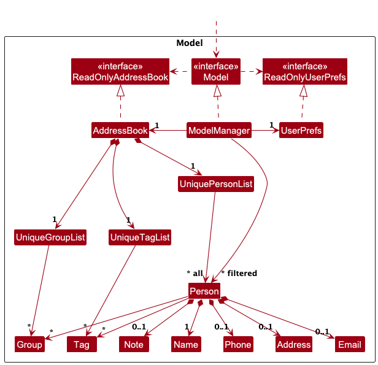

* Table of Contents
{:toc}

--------------------------------------------------------------------------------------------------------------------

## **Acknowledgements**

* Libraries used:
    * [JavaFX](https://openjfx.io/) - GUI framework for building the user interface
    * [JUnit5](https://junit.org/junit5/) - Unit testing framework for comprehensive test coverage
* Build and development tools:
    * [Gradle](https://gradle.org/) - Build automation and dependency management
* Documentation:
    * [Jekyll](https://jekyllrb.com/) - Static site generator for project documentation
    * [PlantUML](https://plantuml.com/) - Automatic generation of UML diagrams from text descriptions.
* AI tools were used overall to do code quality checks for formatting and aesthetic issues, as well as consulting of ideas for how to approach a certain task. These tools were also used to explore further potential test case partitions.
   -  Such tools include GitHub Copilot, Cursor, Codex, Claude

--------------------------------------------------------------------------------------------------------------------

#### **Notes**

> Internally, we have reused file names from the AB-3 project, such as `AddressBook`.
> Please do not confuse this with the reference to our product name, which is "EduTrack".

--------------------------------------------------------------------------------------------------------------------

## **Setting up, getting started**

Refer to the guide [_Setting up and getting started_](SettingUp.md).

--------------------------------------------------------------------------------------------------------------------

## **Design**

:bulb: **Tip:** The `.puml` files used to create diagrams are in this document `docs/diagrams` folder. Refer to the [_PlantUML Tutorial_ at se-edu/guides](https://se-education.org/guides/tutorials/plantUml.html) to learn how to create and edit diagrams.

### Architecture

The ***Architecture Diagram*** given above explains the high-level design of the App.

Given below is a quick overview of main components and how they interact with each other.

**Main components of the architecture**

**`Main`** (consisting of classes [`Main`](https://github.com/AY2526S1-CS2103T-F14a-3/tp/blob/master/src/main/java/edutrack/Main.java) and [`MainApp`](https://github.com/AY2526S1-CS2103T-F14a-3/tp/blob/master/src/main/java/edutrack/MainApp.java)) is in charge of the app launch and shut down.
* At app launch, it initializes the other components in the correct sequence, and connects them up with each other.
* At shut down, it shuts down the other components and invokes cleanup methods where necessary.

The bulk of the app's work is done by the following four components:

* [**`UI`**](#ui-component): The UI of the App.
* [**`Logic`**](#logic-component): The command executor.
* [**`Model`**](#model-component): Holds the data of the App in memory.
* [**`Storage`**](#storage-component): Reads data from, and writes data to, the hard disk.

[**`Commons`**](#common-classes) represents a collection of classes used by multiple other components.

**How the architecture components interact with each other**

The *Sequence Diagram* below shows how the components interact with each other for the scenario where the user issues the command `delete 1`.

Each of the four main components (also shown in the diagram above),

* defines its *API* in an `interface` with the same name as the Component.
* implements its functionality using a concrete `{Component Name}Manager` class (which follows the corresponding API `interface` mentioned in the previous point.

For example, the `Logic` component defines its API in the `Logic.java` interface and implements its functionality using the `LogicManager.java` class which follows the `Logic` interface. Other components interact with a given component through its interface rather than the concrete class (reason: to prevent outside component's being coupled to the implementation of a component), as illustrated in the (partial) class diagram below.

The sections below give more details of each component.

### UI component

The **API** of this component is specified in [`Ui.java`](https://github.com/AY2526S1-CS2103T-F14a-3/tp/blob/master/src/main/java/edutrack/ui/Ui.java)

The UI consists of a `MainWindow` that is made up of parts e.g.`CommandBox`, `ResultDisplay`, `PersonListPanel`, `StatusBarFooter` etc. All these, including the `MainWindow`, inherit from the abstract `UiPart` class which captures the commonalities between classes that represent parts of the visible GUI.

The `UI` component uses the JavaFx UI framework. The layout of these UI parts are defined in matching `.fxml` files that are in the `src/main/resources/view` folder. For example, the layout of the [`MainWindow`](https://github.com/AY2526S1-CS2103T-F14a-3/tp/blob/master/src/main/java/edutrack/ui/MainWindow.java) is specified in [`MainWindow.fxml`](https://github.com/AY2526S1-CS2103T-F14a-3/tp/blob/master/src/main/resources/view/MainWindow.fxml)

The `UI` component,

* executes user commands using the `Logic` component.
* listens for changes to `Model` data so that the UI can be updated with the modified data.
* keeps a reference to the `Logic` component, because the `UI` relies on the `Logic` to execute commands.
* depends on some classes in the `Model` component, as it displays `Person` object residing in the `Model`.

### Logic component

**API** : [`Logic.java`](https://github.com/AY2526S1-CS2103T-F14a-3/tp/blob/master/src/main/java/edutrack/logic/Logic.java)

Here's a (partial) class diagram of the `Logic` component:

The sequence diagram below illustrates the interactions within the `Logic` component, taking `execute("delete 1")` API call as an example.

:information_source: **Note:** The lifeline for `DeleteCommandParser` should end at the destroy marker (X) but due to a limitation of PlantUML, the lifeline continues till the end of diagram.

How the `Logic` component works:

1. When `Logic` is called upon to execute a command, it is passed to an `AddressBookParser` object which in turn creates a parser that matches the command (e.g., `DeleteCommandParser`) and uses it to parse the command.
1. This results in a `Command` object (more precisely, an object of one of its subclasses e.g., `DeleteCommand`) which is executed by the `LogicManager`.
1. The command can communicate with the `Model` when it is executed (e.g. to delete a person). 
   Note that although this is shown as a single step in the diagram above (for simplicity), in the code it can take several interactions (between the command object and the `Model`) to achieve.
1. The result of the command execution is encapsulated as a `CommandResult` object which is returned back from `Logic`.

Here are the other classes in `Logic` (omitted from the class diagram above) that are used for parsing a user command:

How the parsing works:
* When called upon to parse a user command, the `AddressBookParser` class creates an `XYZCommandParser` (`XYZ` is a placeholder for the specific command name e.g., `AddCommandParser`) which uses the other classes shown above to parse the user command and create a `XYZCommand` object (e.g., `AddCommand`) which the `AddressBookParser` returns back as a `Command` object.
* All `XYZCommandParser` classes (e.g., `AddCommandParser`, `DeleteCommandParser`, ...) inherit from the `Parser` interface so that they can be treated similarly where possible e.g, during testing.

### Model component
**API** : [`Model.java`](https://github.com/AY2526S1-CS2103T-F14a-3/tp/blob/master/src/main/java/edutrack/model/Model.java)

The `Model` component,

* stores the address book data, which includes:
  * All `Person` objects contained within a `UniquePersonList`.
  * All `Group` objects contained within a `UniqueGroupList`.
  * All `Tag` objects contained within a `UniqueTagList`.

* stores the currently 'selected' `Person` objects (e.g., results of a search or filter command) as a separate `FilteredList<Person>`, exposed as an unmodifiable `ObservableList<Person>`.
  This allows the UI to automatically update whenever the data in the list changes.

* stores a `UserPref` object that represents the user’s preferences. This is exposed to the outside as a `ReadOnlyUserPref` objects.
* does not depend on any of the other three components (as the `Model` represents data entities of the domain, they should make sense on their own without depending on other components)

:information_source: **Note:** An alternative (arguably, a more OOP) model is given below. It has a `Tag` list in the `AddressBook`, which `Person` references. This allows `AddressBook` to only require one `Tag` object per unique tag, instead of each `Person` needing their own `Tag` objects. 

### Storage component

**API** : [`Storage.java`](https://github.com/AY2526S1-CS2103T-F14a-3/tp/blob/master/src/main/java/edutrack/storage/Storage.java)

The `Storage` component,
* can save both address book data and user preference data in JSON format, and read them back into corresponding objects.
* inherits from both `AddressBookStorage` and `UserPrefStorage`, which means it can be treated as either one (if only the functionality of only one is needed).
* depends on some classes in the `Model` component (because the `Storage` component's job is to save/retrieve objects that belong to the `Model`)

### Common classes

Classes used by multiple components are in the `edutrack.commons` package.

--------------------------------------------------------------------------------------------------------------------

## **Documentation, logging, testing, configuration, dev-ops**

* [Documentation guide](Documentation.md)
* [Testing guide](Testing.md)
* [Logging guide](Logging.md)
* [Configuration guide](Configuration.md)
* [DevOps guide](DevOps.md)

--------------------------------------------------------------------------------------------------------------------

## **Appendix: Requirements**

### Product scope

**Target user profile**:

* has a need to keep track of multiple students
* prefer desktop apps over other types
* can type fast
* prefers typing to mouse interactions
* is reasonably comfortable using CLI apps
* is a tutor (school or private)
* wants to record attendance, participation, and progress
* needs to manage student contact info and meetings

**Value proposition**:

* manage contacts faster than a typical mouse/GUI driven app
* centralises management of students for tutors instead of multiple trackers over unsynced platforms
* lightweight, fast to load, and easy to use

### User stories

Priorities: High (must have) - `* * *`, Medium (nice to have) - `* *`, Low (unlikely to have) - `*`

| Priority | As a …        | I want to …                                                                              | So that I can…                                     |
| -------- | ------------- | ---------------------------------------------------------------------------------------- | -------------------------------------------------- |
| `* * *`  | tutor         | organise students into their different classes.                                          | organize by tutorial group                         |
| `* * *`  | tutor         | select specific groups to view                                                           | see students by group                              |
| `* * *`  | tutor         | search for a specific student                                                            | contact him                                        |
| `* * *`  | tutor         | tag students with custom labels                                                          | track behavioural trends.                          |
| `* * *`  | tutor         | add a tag to my weaker students                                                          | remember to check in on them                       |
| `* *`    | tutor         | sort by day                                                                              | know which groups I have for that day              |
| `* *`    | tutor         | archive students                                                                         | view current vs past students                      |
| `* *`    | tutor         | filter students by performance metrics                                                   | identify weaker students.                          |
| `* *`    | tutor         | record participation (e.g., "active," "quiet," "needs improvement")                      | track and assess student engagement.                |
| `* *`    | tutor         | filter students to identify those that need more help versus those on schedule           | quickly identify at-risk students                  |
| `* *`    | tutor         | add the contact details of my student                                                    | contact them                                       |
| `* *`    | tutor         | edit the contact details of my student                                                   | have accurate info                                 |
| `* *`    | busy tutor    | track the assignments that I have given out                                              | know when to expect work to be handed in.          |
| `* *`    | busy tutor    | take attendance easily                                                                   | spend more time teaching in class.                 |
| `* *`    | private tutor | track student addresses                                                                  | go to their house                                  |
| `* *`    | private tutor | track payments                                                                           | keep track of current students                     |
| `*`      | tutor         | create events for classes and office hours                                               | keep track of my events                            |
| `*`      | tutor         | record test and assignment scores                                                        | track academic progress.                           |
| `*`      | tutor         | export attendance and progress reports                                                   | share them with parents or institutions.           |
| `*`      | tutor         | filter reports by timeframe (e.g., monthly / termly)                                     | measure improvement over periods.                  |
| `*`      | tutor         | attach files to students' absences                                                       | easily track the relevant certificates of absence. |
| `*`      | tutor         | see progress graphs for each student                                                     | visualise improvement                              |
| `*`      | busy tutor    | check on my students' progress in one place                                              | easily differentiate who to help out more.         |
| `*`      | busy tutor    | quickly view my student's statistics at a glance                                         | have a quick overview of my class' progress.       |

### Use cases

(For all use cases below, the **System** is the `AddressBook` and the **Actor** is the `user`, unless specified otherwise)

**Use case: Add a person**

**MSS:**

1.  User inputs person details to be added.
2.  System validates relevant parameters.
3.  System adds the person.
4.  System confirms that person has been added.

    Use case ends.

**Extensions**

* 2a. Person already exists in the address book.
  * 2a1. System rejects the addition as a duplicate.

* 2b. Required field missing.
  * 2b1. System prompts the User to request addition again with the missing details.

* 2c. Any field contains invalid data.
    * 2c1. System rejects the addition and displays an appropriate error message.

**Use case: Delete a person**

**Preconditions:**
- At least one person exists in the address book.

**MSS:**

1.  User requests to delete a specific person in the list.
2.  System deletes the person.

    Use case ends.

**Extensions**

* 2a. The parameter is invalid.
    * 2b1. System rejects the deletion and displays an appropriate error message.

    Use case ends.

**Use case: Search for a Person by Parameter**

**Preconditions:**
- At least one person exists in the address book.

**MSS:**

1. User requests to find a person by providing a parameter.
2. System searches through all stored persons.
3. System shows a list of persons whose parameter match the query.

    Use case ends.

**Extensions**

* 1a. No parameter provided.
  * 1a1. System prompts User to provide a parameter.

    Use case ends.

* 3a. No matching persons found
  * 3a1. System informs the User that no results were found.

    Use case ends.

**Use case: Create a Group or Tag**

**MSS:**
1. User requests to create a new group or tag by specifying a name.
2. System validates the name.
3. System creates the new group or tag.
4. System confirms the successful creation.

   Use case ends.

**Extensions:**
* 2a. Invalid group or tag name
  * 2a1. System rejects the request and shows an appropriate error message.

    Use case ends.

* 2b. Group or tag name already exists
  * 2b1. System rejects the request to prevent duplicates.

    Use case ends.

* 2c. No name provided
  * 2c1. System asks the user to input a valid name.

    Use case ends.

**Use case: Assign Persons to a Group or Tag**

**Preconditions:**
- The group or tag and persons exist in the system.

**MSS:**
1. User requests to assign one or more persons to an existing group or tag.
2. System verifies that the specified group or tag exists.
3. System validates that the referenced persons exist.
4. System validates that the persons are not already assigned to the group or tag.
5. System assigns those persons to the group or tag.
6. System confirms that the persons were successfully added to the group or tag.

   Use case ends.

**Extensions:**
- 2a. The specified group or tag does not exist
  - 2a1. System informs the user that the group is invalid.

    Use case ends.
- 3a. One or more person references are invalid
  - 3a1. System informs the user which entries are invalid.

    Use case ends.
- 4a. Some persons are already assigned to the group or tag
  - 4a1. System informs the user about the duplicates and rejects the assignment.

    Use case ends.

**Use case: Unassign a Person from a Group or Tag**

**Preconditions:**
- The group or tag exists and the person is already assigned to it.

**MSS:**
1. User requests to remove a person from a group or tag.
2. System verifies that the person belongs to the specified group or tag.
3. System removes the person from the group or tag.
4. System confirms that the unassignment is complete.

**Extensions:**
- 1a. The specified group or tag does not exist
    - 1a1. System informs the user that the group or tag is invalid.
- 2a. The person is not assigned to that group or tag
  - 2a1. System rejects the unassignment request.

### Non-Functional Requirements

1.  Should work on any _mainstream OS_ as long as it has Java `17` or above installed.
2.  Should be able to complete commands within 500ms for typical operations (add, delete, find) when handling up to 1000 persons.
3.  A user with above-average typing speed (around 50-70 words per minute for regular English text) should be able to accomplish a standard workflow (add, find, edit) faster using commands than using the mouse.
4.  Should be able to start up within 3 seconds on a typical modern computer.
5.  The application should use less than 500MB of memory while running on a typical modern computer.
6.  All error messages must be clear and actionable for end users.
7.  The documentation should be up-to-date and easy to follow for new developers.
8.  The application must not crash when given invalid input.

### Glossary

* **Mainstream OS**: Windows, Linux, Unix, MacOS
* **System**: The EduTrack application itself, referring to automated processes performed by the software.
* **Actor**: The user interacting with EduTrack (typically a tutor or administrator).
* **Entity**: A core data object in EduTrack, such as `Person`, `Group`, or `Tag`.
* **Filter/Predicate**: A condition used to select a subset of persons from the full list (e.g., searching by name or group).
* **Cascade Delete**: An automatic operation where deleting a group or tag also removes it from all assigned persons.
* **CLI**: Command Line Interface; a text-based interface where users type commands rather than clicking buttons.
* **AddressBook** (Legacy): The predecessor application upon which EduTrack was based; now referred to as EduTrack.
* **Unsynced Platforms**: Multiple separate systems or trackers (not connected to each other) that do not share or update data between them.

--------------------------------------------------------------------------------------------------------------------

## **Appendix: Instructions for manual testing**

Given below are instructions to test the app manually.

:information_source: **Note:** These instructions only provide a starting point for testers to work on;
testers are expected to do more *exploratory* testing.

### Launch and shutdown

1. Initial launch

   1. Download the jar file and copy into an empty folder

   1. Open a command terminal in that folder and run `java -jar edutrack.jar` 
      Expected: Shows the GUI with a set of sample contacts. The window size may not be optimum.

1. Saving window preferences

   1. Resize the window to an optimum size. Move the window to a different location. Close the window.

   1. Re-launch the app by running `java -jar edutrack.jar` in a terminal. 
       Expected: The most recent window size and location is retained.

### Deleting a person

1. Deleting a person while all persons are being shown

   1. Prerequisites: List all persons using the `list` command. Multiple persons in the list.

   1. Test case: `delete 1` 
      Expected: First contact is deleted from the list. Details of the deleted contact shown in the status message. Timestamp in the status bar is updated.

   1. Test case: `delete 0` 
      Expected: No person is deleted. Error details shown in the status message.

   1. Other incorrect delete commands to try: `delete`, `delete x`, `...` (where x is larger than the list size) 
      Expected: Similar to previous.

### Adding a person

1. Adding a person with only required fields

   1. Test case: `add n/John Doe` 
      Expected: Person with name "John Doe" is added to the list. Details of the added person shown in the status message.

   1. Test case: `add n/Jane Smith p/91234567 e/jane@example.com a/123 Baker St` 
      Expected: Person with all contact details is added. Success message shown.

   1. Test case: `add n/` 
      Expected: No person is added. Error message indicating invalid command format shown.

   1. Test case: `add n/John Doe g/NonExistentGroup` 
      Expected: No person is added. Error message indicating group does not exist shown.

### Creating and managing groups

1. Creating a new group

   1. Prerequisites: Group "CS2103T" does not exist yet.

   1. Test case: `group/create g/CS2103T` 
      Expected: New group "CS2103T" is created. Success message shown.

   1. Test case: `group/create g/CS2103T` (when group already exists) 
      Expected: No group is created. Error message indicating duplicate group shown.

   1. Test case: `group/create g/` 
      Expected: No group is created. Error message about invalid format shown.

1. Assigning persons to a group

   1. Prerequisites: List all persons using `list` command. At least 2 persons in the list. Group "CS2103T" exists.

   1. Test case: `group/assign 1 g/CS2103T` 
      Expected: First person is assigned to group "CS2103T". Success message shown.

   1. Test case: `group/assign 1 2 g/CS2103T` 
      Expected: First and second persons are assigned to the group. Success message showing number of persons assigned.

   1. Test case: `group/assign 0 g/CS2103T` 
      Expected: No assignment occurs. Error message about invalid index shown.

1. Deleting a group

   1. Prerequisites: Group "CS2103T" exists and is assigned to some persons.

   1. Test case: `group/delete g/CS2103T` 
      Expected: Group is deleted and removed from all assigned persons. Success message shown.

   1. Test case: `group/list` 
      Expected: Deleted group should not appear in the list.

### Creating and managing tags

1. Creating a new tag

   1. Prerequisites: Tag "needs_help" does not exist yet.

   1. Test case: `tag/create t/needs_help` 
      Expected: New tag "needs_help" is created. Success message shown.

   1. Test case: `tag/create t/needs_help` (when tag already exists) 
      Expected: No tag is created. Error message indicating duplicate tag shown.

1. Assigning tags to persons

   1. Prerequisites: List all persons using `list` command. At least 1 person in the list. Tag "needs_help" exists.

   1. Test case: `tag/assign 1 t/needs_help` 
      Expected: First person is assigned the tag "needs_help". Success message shown.

   1. Test case: `tag/assign 999 t/needs_help` (where 999 is larger than list size) 
      Expected: No assignment occurs. Error message about invalid index shown.

### Finding persons

1. Finding persons by name

   1. Test case: `find n/John` 
      Expected: All persons with "John" in their name are listed. Number of persons found shown in status message.

   1. Test case: `find n/alex david` 
      Expected: All persons with either "alex" or "david" in their name are listed.

   1. Test case: `find` 
      Expected: No filtering occurs. Error message about invalid format shown.

1. Finding persons by group

    1. Test case: `find g/CS2013T` 
       Expected: All persons in group "CS2103T". Number of persons found shown in status message.

    1. Test case: `find` 
       Expected: No filtering occurs. Error message about invalid format shown.

1. Finding persons by tag

   1. Test case: `findtag t/needs_help` 
      Expected: All persons with the "needs_help" tag are listed. Number of persons found shown.

   1. Test case: `findtag t/tag1 t/tag2` 
      Expected: Error message indicating only one tag is allowed.

### Editing a person

1. Editing person details

   1. Prerequisites: List all persons using `list` command. Multiple persons in the list.

   1. Test case: `edit 1 p/91234567 e/emailaddress@email.com` 
      Expected: First person's phone and email are updated. Success message shown.

   1. Test case: `edit 1 n/New Name` 
      Expected: First person's name is updated to "New Name". Success message shown.

   1. Test case: `edit 1 g/` 
      Expected: All groups are removed from the first person. Success message shown.

   1. Test case: `edit 0 n/New Name` 
      Expected: No person is edited. Error message about invalid index shown.

   1. Test case: `edit 1` 
      Expected: No person is edited. Error message indicating at least one field must be provided.

### Saving data

1. Dealing with missing/corrupted data files

   1. Test case: Delete the data file at `[JAR file location]/data/edutrack.json` and launch the app. 
      Expected: App starts with sample data.

   1. Test case: Open the data file and add invalid JSON syntax (e.g., remove a closing brace), then launch the app. 
      Expected: App starts with an empty address book, discarding the corrupted data.

--------------------------------------------------------------------------------------------------------------------

## **Appendix: Effort**

### Difficulty Level

Our project, EduTrack, extends the AB3 baseline with significantly increased complexity. While AB3 manages a single entity type `Person`, EduTrack introduces **three entity types**: `Person`, `Group`, and `Tag`. This required substantial effort in designing relationships, maintaining data consistency, and ensuring proper cascading operations.

The difficulty was further amplified by the need to:
- Implement a centralized management system for Groups and Tags (similar to how AB3 manages Persons)
- Design and implement 10+ new commands for group and tag operations
- Ensure bidirectional relationships between entities remain consistent
- Handle complex cascading deletions (e.g., deleting a group must remove it from all assigned persons)

### Challenges Faced

**1. Entity Relationship Management**

The most significant challenge was managing the relationships between `Person`, `Group`, and `Tag` entities. Unlike AB3's simple list of persons, our system required:
- `UniqueGroupList` and `UniqueTagList` to centrally manage groups and tags
- Ensuring that persons can only be assigned to existing groups/tags
- Implementing cascading updates when groups/tags are deleted

**2. Storage Complexity**

Extending the JSON storage to handle three entity types while maintaining referential integrity was challenging. We had to:
- Design JSON schemas for groups and tags
- Implement proper serialization/deserialization for the new entities
- Add validation to ensure stored data maintains consistency (e.g., persons don't reference non-existent groups)
- Handle backward compatibility and corrupted data scenarios

**3. UI Enhancements**

We enhanced the UI to display both groups and tags for each person, which required:
- Modifying the `PersonCard` UI component to display multiple entity types
- Implementing proper wrapping behavior for tags and groups to prevent overflow
- Adding visual distinction between tags and groups (different colors)
- Ensuring the UI updates correctly when groups/tags are added or removed

**4. Command Parser Architecture**

Adding 10+ new commands required careful design of the parser architecture:
- Implemented parsers for all group operations (`group/create`, `group/delete`, `group/assign`, `group/unassign`, `group/list`)
- Implemented parsers for all tag operations (`tag/create`, `tag/delete`, `tag/assign`, `tag/unassign`, `tag/list`)
- Added `findtag` command with specialized predicate for tag-based filtering
- Ensured consistent error handling and validation across all new commands

### Effort Required

The project required approximately **3-4 times** the effort of AB3:

**Code Contribution:**
- Added 20+ new classes for commands, parsers, and predicates
- Modified 15+ existing classes to support the new entity types
- Implemented comprehensive test coverage with 350+ test cases
- Total: ~4000+ lines of functional code and ~3000+ lines of test code

**Time Investment:**
- Design and planning: ~10 hours (entity relationships, storage design, command structure)
- Implementation: ~70 hours (commands, storage, model changes, UI updates)
- Testing: ~20 hours (unit tests, integration tests, manual testing)
- Documentation: ~20 hours (User Guide, Developer Guide, diagrams)
- Total: ~120 hours of development effort

### Achievements

Despite the challenges, we successfully delivered a robust tutor management system with the following achievements:

1. **Centralized Entity Management**: Implemented a scalable architecture where groups and tags are managed centrally, preventing duplication and inconsistencies.

2. **Data Integrity**: Implemented cascading operations ensuring that deleting a group/tag automatically removes it from all assigned persons, maintaining referential integrity.

3. **Enhanced Search Capabilities**: Users can find persons by groups and tags, providing powerful filtering options.

4. **Robust Testing**: Achieved high test coverage with comprehensive unit and integration tests, ensuring reliability.

5. **User-Friendly UI**: Enhanced the UI to clearly display multiple entity types with visual distinction and proper overflow handling.

### Reuse and Adaptation

While we built most features from scratch, we reused and adapted several components from AB3:

1. **Storage Framework (~10% effort saved)**: We reused AB3's `JsonSerializableAddressBook` architecture and adapted it to handle `Group` and `Tag` entities. Our work is primarily contained in:
   - `JsonAdaptedGroup.java` and `JsonAdaptedTag.java` for serialization
   - `JsonSerializableAddressBook.java` modifications to handle the new entity lists

2. **Command Architecture (~5% effort saved)**: We followed AB3's `Command` and `CommandParser` patterns, which provided a solid foundation. However, we still had to implement all the logic for our 10+ new commands.

3. **UI Components (~5% effort saved)**: We extended AB3's `PersonCard` component rather than building from scratch, but significant modifications were needed to display groups and tags with proper styling.

**Total effort saved through reuse: ~20%**

The remaining 80% of effort went into designing the multi-entity architecture, implementing new commands, ensuring data consistency, and building comprehensive test coverage, all of which required substantial original work beyond AB3's scope.

--------------------------------------------------------------------------------------------------------------------

## **Appendix: Planned Enhancements**

Team size: 5

1. **Check for excessive whitespace in-between words for certain parameters**

Right now, if a user does

`add n/ Meng Shuo`

and then subsequently does

`add n/ Meng `         ` `         ` `         `   Shuo` (note the extra spaces in between "Meng" and "Shuo")

These two successive commands are successful, and allow the addiiton of these two students as distinct Person objects internally.

In the future, we may consider validating parameters for such cases of excessive whitespace, as these should be counted as duplicate entries.

2. **Standardise reference to "Person" class in all application user-facing messages**

Right now, EduTrack sometimes refers to the contacts / objects being added or listed (or any equivalent operation acting on the Person class) as "persons"

Example: A successful `findtag` command on a tag with 2 students tagged, displays

> 2 persons listed!

In the future, it may be better to standardise these messages to use the word "students" instead of "persons" for a better and closer fit to our product use case.

3. **Improve handling of case for when assigning / unassigning group to existing person in group**

Currently, if you try to assign a valid group to a valid and existing student who already has that group assigned, the command will be successful and a message is displayed that says:

> Assigned group [GROUPNAME] to 0 person(s)

Similar behaviour occurs with group/unassign.

In the future, a better way to handle this would be to display an error message to clearly state the issue here.

4. **Standardise format of error messages**

Currently, some commands have inconsistent error messages.

Example:

An unsuccessful `add` command shows this in the result display:
>Invalid command format!
>
>add: Adds a person to the address book. Parameters: n/NAME [p/PHONE] [e/EMAIL] [a/ADDRESS] [t/TAG]... [g/GROUP]...
Example: add n/John Doe p/98765432 e/johnd@example.com a/311, Clementi Ave 2, #02-25 t/friends t/owesMoney g/CS2103T g/CS2101

While an unsuccessful `group/delete`, for example, shows this:

> You have to input a group name!

In the future, it will be a much better user experience to have error messages standardised, to make them more effective in helping users.

5. **Better UI/UX handling of cases where inputs to attributes are too long**

Right now, we have a immediate fix of handling overly-long inputs to student attributes by limiting the number of characters to the fields, as well as allowing the text to wrap.

In the future, we can explore better ways to handle such cases, because we do not want to overzealously validate the input. For instance, in some extreme-but-valid cases, there may be a real need in the future for tutors to input a very, very long note, that well exceeds our current character limit.

Similarly, in the future, phone numbers may (with a non-zero chance) evolve to become more than 100 characters long.

6. **Standardise reference to person / student in all internal and external guides**

Right now, in the Developer Guide, under the Use Cases, we use the term "persons" for consistency with the Person class which is internally named as such.

Intuiively, it would be extremely difficult to argue that there is any level of ambiguity to what "person" means in this context, assuming a basal level of comprehension for our product use-case.

However, it is a possibility that in the future, there mat be a major refactor of the code that renames Person to Student, for which the Developer Guides (amd all other related guides) be updated accordingly.

7. **Standardisation of Group and Tag Features**

Currently, the implementations of Group and Tag differ slightly in terms of command behaviour and user interface:

The group/list command displays all groups directly in the Main Window, while
the tag/list command displays all tags in the Help Window.

Similarly, the commands for searching differ in syntax:

`find g/GROUP_KEYWORD` — finds persons by their assigned groups.

`findtag t/TAG_KEYWORD` — finds persons by their assigned tags.

These differences arose from independent feature development for groups and tags.
In future iterations, EduTrack will standardise their behaviour so that both entities share consistent command structures, output displays, and user experiences.
This will improve usability and make command usage more predictable for users.

8. **Possible addiiton of Colorblind mode / High-constrast UI mode**

Right now, we are relying on colour to visually distuinguish between tags and groups in our UI.

In the future, it will be helpful to have a colorblind mode that helps those who suffer from colour deficiency use our app more effectively, given that some of them may have difficulty identifying which are tags and which are groups based on colour alone.

9. **Add Attendance Tracking Feature**

Currently, EduTrack does not have a built-in way to track student attendance for tutorial sessions or classes.

In the future, we plan to add simple attendance tracking functionality that allows tutors to:
- Mark students as present or absent for a particular date or session
- View attendance history for individual students
- Generate basic attendance statistics (e.g., attendance rate per student or per group)

This feature would integrate naturally with the existing group system, allowing tutors to take attendance for entire groups at once.
Example commands might include:
- `attendance/mark INDEX [MORE_INDEXES]... d/DATE` — marks specified students as present for a given date
- `attendance/view INDEX` — displays attendance history for a specific student
- `attendance/stats [g/GROUP]` — shows attendance statistics for all students or a specific group

This enhancement aligns with our target user profile (tutors managing multiple students) and addresses a common need identified in our user stories, making EduTrack a more cohesive classroom management tool.

10. **Improve handling of duplicate phone numbers and emails across different students**

Right now, for two unique students, our program allows them to have fields that are the same.

For example, I can have a student

> Name: John Tan
> Phone: 100
> Email: john@gmail.com
> ... (other fields)

as well as a student

> Name: John Lim
> Phone: 100
> Email: john@gmail.com
> ... (other fields)

We know intuively that two distinct students cannot have the same phone number or the exact same email address, as everyone is expected to have a unique and distinct phone number.

Yet, in our current application, users are allowed to add distinct students (with different names) but yet have exact same phone numbers, emails, address.

In the future, we plan to add optional validation warnings (not hard errors) when duplicate address, phone numbers or emails are detected during `add` or `edit` command execution. The system would display a warning message such as:

> Warning: This phone number is already used by [Student Name]. Do you want to continue? (y/n)

This enhancement would:
- Help tutors avoid accidental data entry mistakes
- Maintain flexibility by allowing duplicates when intentional (e.g., siblings using the same address)
- Keep the application usable while improving data quality
- Not break existing functionality or workflows

Implementation would involve:
- Adding predicates to check for existing phone/email matches in the address book
- Modifying the `add` and `edit` command flow to include an optional confirmation step
- Displaying informative warnings without blocking the operation entirely

This enhancement addresses a usability concern that makes the product imperfect but still functional, improving the overall user experience for tutors managing student contact information.

